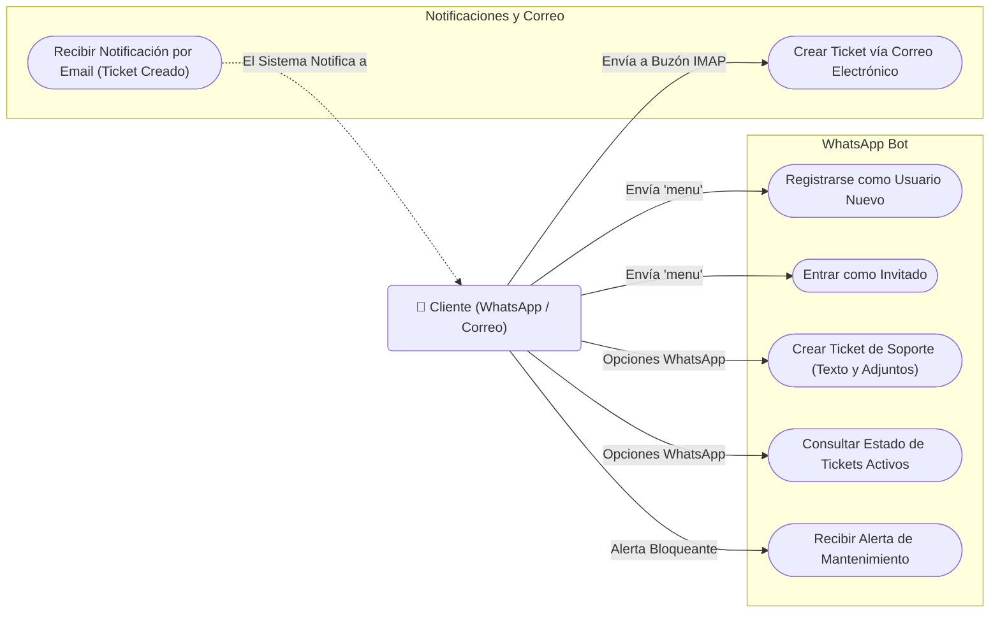
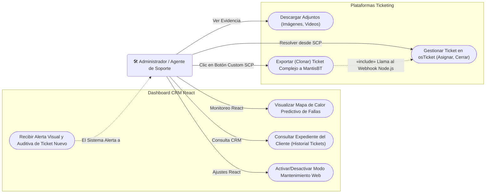
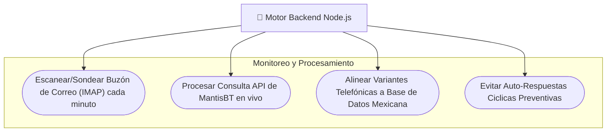

# Diagramas de Casos de Uso: Bot de Soporte Integral

A continuación se presentan los diagramas de Casos de Uso (Use Cases) del sistema que hemos construido. Están divididos por el **Actor Principal** para que sean fáciles de leer e interpretar si los necesitas para documentación técnica o académica.

## 1. Casos de Uso del Cliente (Usuario Final)
Este diagrama ilustra todas las acciones que un cliente puede realizar al interactuar con el bot de WhatsApp o al enviar un correo, así como las respuestas que obtiene del sistema.

---

## 2. Casos de Uso del Administrador / Agente de Soporte
Este diagrama detalla todas las acciones gerenciales y de gestión que tienes tú como Administrador o Agente de Soporte al utilizar tu Panel React CRM y las plataformas de Tickets.

---

## 3. Casos de Uso del Backend Automático (El Sistema en la Sombra)
Este diagrama muestra cómo los distintos servidores (Node.js, MySQL, Mantis API) se comunican invisiblemente por detrás sin intervención humana.

> [!TIP] Documentación Extensible
> Si necesitas entregar esta documentación a tu escuela o jefe, estos gráficos en formato "Mermaid" son el estándar oficial en plataformas como GitHub y Notion. 
> Cada nodo ovalado representa un **Caso de Uso** (la acción y el objetivo), y los cuadritos al inicio representan al **Actor** que interactúa con el sistema.
